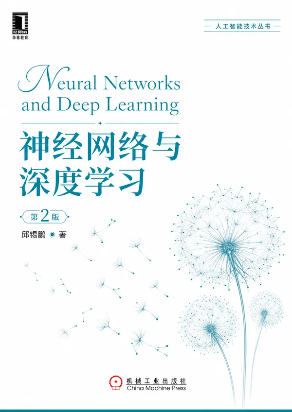
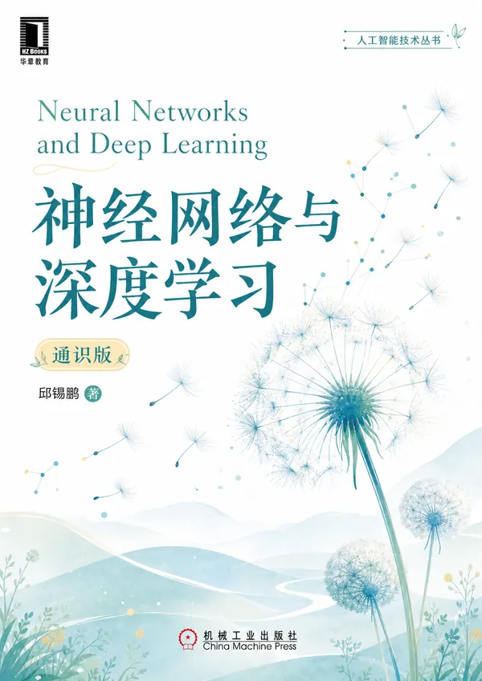

# 神经网络与深度学习

<strong>两种读法，同一条学习主线。</strong>

  <a href="https://nndl.ai/">系列主站</a> ·
  <a href="https://github.com/nndl/nndl/releases/download/book-pdf/nndl-v2.pdf">第二版 PDF</a> ·
  <a href="https://github.com/nndl/nndl/releases/download/book-pdf/nndl-ge.pdf">通识版 PDF</a> ·
  <a href="https://nndl.ai/reading-path/">阅读路径</a> ·
  <a href="https://github.com/nndl/nndl/issues">勘误与建议</a>

本仓库是邱锡鹏《神经网络与深度学习》系列中理论版与通识版的统一入口，提供出版前电子稿、章节目录、版本说明和勘误反馈。

第一次接触 AI、希望先建立直觉，可以从<strong>通识版</strong>开始；希望系统学习原理、用于专业课程或研究入门，推荐以<strong>第二版（蒲公英书）</strong>为主；想边学边写代码，可搭配[《神经网络与深度学习：案例与实践》](https://github.com/nndl/nndl-practice)。

## 两本书

<table>
  <tr>
    <td width="50%" valign="top" align="center">
      
      <h3>《神经网络与深度学习》第二版</h3>
      
<strong>系统掌握理论与方法</strong>

      
“蒲公英书”的理论主线。从机器学习基础出发，系统讲解经典神经网络、优化、Transformer、图神经网络、强化学习、生成模型，以及大语言模型与智能体。

      
<strong>适合：</strong>专业课程、研究入门，以及希望建立完整理论框架的读者。

      
<strong>结构：</strong>3 个部分、16 章，另有 5 个数学基础附录。

      
<a href="https://github.com/nndl/nndl/releases/download/book-pdf/nndl-v2.pdf"><strong>下载 PDF</strong></a> · <a href="https://nndl.ai/nndl-v2/">本书页面</a> · <a href="#第二版目录">章节目录</a>

    </td>
    <td width="50%" valign="top" align="center">
      
      <h3>《神经网络与深度学习》通识版</h3>
      
<strong>少一些公式，多一些直觉</strong>

      
用故事、案例和生活类比解释神经网络与深度学习，并延伸到大语言模型、智能体、多模态、科学智能、具身智能、AI 安全与未来。

      
<strong>适合：</strong>非专业读者、跨学科入门、高校通识课，以及希望快速看懂现代 AI 的读者。

      
<strong>结构：</strong>16 章，从机器学习基础一路讲到 AGI。

      
<a href="https://github.com/nndl/nndl/releases/download/book-pdf/nndl-ge.pdf"><strong>下载 PDF</strong></a> · <a href="https://nndl.ai/nndl-ge/">本书页面</a> · <a href="#通识版目录">章节目录</a>

    </td>
  </tr>
</table>

两本书目前均处于出版筹备阶段，开放的是持续更新的出版前电子稿，不等同于最终纸质版。ISBN、定价和上市时间以出版社后续公告为准。

## 怎么选

| | 第二版（蒲公英书） | 通识版 |
|---|---|---|
| 适合读者 | 计算机、人工智能及相关专业学生，工程师与研究者 | 非专业读者、跨学科读者、通识课学生 |
| 数学要求 | 接受公式与推导；书后提供数学基础附录 | 以直觉和案例为主，理解函数、向量、概率的基本含义即可 |
| 阅读目标 | 建立完整的神经网络与深度学习理论体系 | 看懂技术脉络、核心思想、能力边界与现实影响 |
| 推荐方式 | 系统学习或课程使用时作为主线教材 | 第一次接触 AI 时先读，也可作为第二版的先导读物 |

## 章节目录

### 第二版目录

展开 16 章与 5 个数学基础附录

#### 第一部分：机器学习基础

- 第 1 章　绪论
- 第 2 章　机器学习概述
- 第 3 章　线性模型

#### 第二部分：基础模型

- 第 4 章　前馈神经网络
- 第 5 章　卷积神经网络
- 第 6 章　循环神经网络
- 第 7 章　网络优化与正则化
- 第 8 章　注意力机制与 Transformer
- 第 9 章　图神经网络

#### 第三部分：进阶主题

- 第 10 章　无监督学习
- 第 11 章　模型独立的学习方式
- 第 12 章　深度强化学习
- 第 13 章　大语言模型与智能体
- 第 14 章　概率图模型
- 第 15 章　深度信念网络
- 第 16 章　深度生成模型

#### 数学基础附录

- 附录 A　线性代数
- 附录 B　微积分
- 附录 C　数学优化
- 附录 D　概率论
- 附录 E　信息论

### 通识版目录

下面的四组是便于浏览的阅读导航，不是书中的正式分篇。

展开通识版 16 章

#### 理解学习（第 1—4 章）

- 第 1 章　智能的第三次浪潮
- 第 2 章　机器如何自己学习
- 第 3 章　从神经元到深度网络
- 第 4 章　把网络训好的艺术

#### 走向大模型（第 5—8 章）

- 第 5 章　注意力：引爆大模型的引擎
- 第 6 章　无师自通：从数据中自学
- 第 7 章　在试错中成长：强化学习
- 第 8 章　语言的魔法：大语言模型

#### 系统与新型生成（第 9—12 章）

- 第 9 章　钢与硅：AI 的物理底座
- 第 10 章　智能的延伸：AI 智能体
- 第 11 章　从噪声中创造：扩散模型
- 第 12 章　看听说一体：多模态 AI

#### 科学、身体与未来（第 13—16 章）

- 第 13 章　AI 遇上科学：加速发现的新引擎
- 第 14 章　走进物理世界：具身智能与机器人
- 第 15 章　脆弱的巨人：AI 的风险与挑战
- 第 16 章　通往通用智能：AI 的下一站

## 下载与版本

| 书 | 出版前电子稿 | 本书页面 |
|---|---|---|
| 第二版（蒲公英书） | [下载 PDF](https://github.com/nndl/nndl/releases/download/book-pdf/nndl-v2.pdf) | [nndl.ai/nndl-v2](https://nndl.ai/nndl-v2/) |
| 通识版 | [下载 PDF](https://github.com/nndl/nndl/releases/download/book-pdf/nndl-ge.pdf) | [nndl.ai/nndl-ge](https://nndl.ai/nndl-ge/) |

历史发布记录见 [GitHub Releases](https://github.com/nndl/nndl/releases)。固定 PDF 地址保持不变，内容会随出版前修订更新。

## 勘误与建议

欢迎通过 [GitHub Issues](https://github.com/nndl/nndl/issues) 提交勘误和改进建议。提交前请先搜索是否已有相同问题，并尽量注明：

- 书名与版本；
- 章节及 PDF 页码或纸书页码；
- PDF 下载或阅读日期；
- 原文、问题说明与建议修改。

[查看已有反馈](https://github.com/nndl/nndl/issues) · [提交新反馈](https://github.com/nndl/nndl/issues/new/choose)

## 主站与配套资源

- [系列主站](https://nndl.ai/)
- [阅读路径与选书建议](https://nndl.ai/reading-path/)
- [《神经网络与深度学习：案例与实践》](https://github.com/nndl/nndl-practice)：配套工程实践与 PyTorch / PaddlePaddle 代码
- [《大模型与智能体》](https://github.com/nndl/llm-beginner)：面向大模型与智能体的专题读本

## 第一版归档

- [`legacy/nndl-v1/`](legacy/nndl-v1/)：第一版 PDF、勘误与封面
- [`nndl-v1` 分支](https://github.com/nndl/nndl/tree/nndl-v1)：第一版完整资料，包括各章 PDF 与教学幻灯片

## 仓库维护说明

- [`nndl-v2/`](nndl-v2/)：第二版的主站元数据与说明页；第二版 LaTeX 源码不在本公开仓库中。
- [`nndl-ge/`](nndl-ge/)：通识版的主站元数据与说明页。
- 各书目录的 `_meta.yml` 是主站书目卡片的数据源，由 [`nndl.github.io/scripts/aggregate-books.py`](https://github.com/nndl/nndl.github.io/blob/main/scripts/aggregate-books.py) 聚合生成主站数据。

## Star History

<a href="https://www.star-history.com/?repos=nndl%2Fnndl&type=date&legend=top-left">
 <picture>
   <source media="(prefers-color-scheme: dark)" srcset="https://api.star-history.com/chart?repos=nndl/nndl&type=date&theme=dark&legend=top-left&sealed_token=04fpFWw5XHn-ZYLH87cz43lZipOv-swz0u-Mpe4ns2nwuzcrzfNFGikiGlokhmLeGY1xnDYBRt5ITAtg4mIU3KZhSDGQGm7kNDuVRukImKDN5CRXIr7wh-6rQwGnuERP0Jeecv5GSTye-_Q1Eb03DnIDZpPAaKhX_E3lMcNxCuJAyzNjhsnCyxw3_HgR" />
   <source media="(prefers-color-scheme: light)" srcset="https://api.star-history.com/chart?repos=nndl/nndl&type=date&legend=top-left&sealed_token=04fpFWw5XHn-ZYLH87cz43lZipOv-swz0u-Mpe4ns2nwuzcrzfNFGikiGlokhmLeGY1xnDYBRt5ITAtg4mIU3KZhSDGQGm7kNDuVRukImKDN5CRXIr7wh-6rQwGnuERP0Jeecv5GSTye-_Q1Eb03DnIDZpPAaKhX_E3lMcNxCuJAyzNjhsnCyxw3_HgR" />
   
 </picture>
</a>
